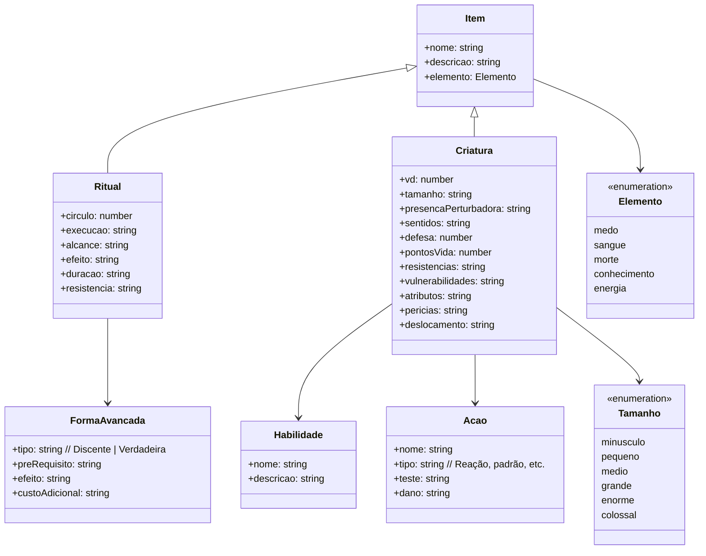

# 🜏 Ordo Realitas

Sistema web inspirado no universo de RPG paranormal, com foco em rituais, criaturas e gerenciamento de agentes.

## 🌐 Estrutura de Rotas

```
/                # Login (tela inicial)
/ordem           # Hub principal

/ordem/bestiario
/ordem/grimorio
/ordem/agentes
/ordem/arquivos
/ordem/missoes
```

- `/` → autenticação
- `/ordem/...` → área protegida

## 🔐 Login (`/`)

Tela inicial do sistema.

### Layout

- Logo central (Ordo Realitas)
- Texto: `Bem vindo, Agente.`
- Inputs:
  - `agent_id`
  - `password`

- Botão: `Acessar sistema`

### Feedback

- `Validando credenciais...`
- `Acesso autorizado`
- `Falha de autenticação`

### Fluxo

```
/ → /ordem
```

## 🧠 Ordem (`/ordem`)

Interface principal estilo sistema operacional com aplicativos.

### Layout

**Aplicativos em Grid**
Cada item abre um módulo do sistema.

- [ 👁️ Bestiário ]
- [ 📜 Grimório ]
- [ 🧍 Agentes ]
- [ 📁 Arquivos ]

## 👁️ Bestiário (`/ordem/bestiario`)

Catálogo de criaturas estilo dossiê.

### Lista

- Grid de criaturas
- Filtros:
  - Elemento
  - VD (nível de perigo)

### Detalhe

- Nome
- Atributos
- Pontos de Vida
- Defesa
- Resistências
- Vulnerabilidades
- Habilidades
- Ações

---

## 📜 Grimório (`/ordem/grimorio`)

Catálogo de rituais.

### Lista

- Grid de rituais
- Filtros:
  - Elemento
  - Círculo

### Detalhe

- Execução
- Alcance
- Efeito
- Duração
- Resistência
- Formas avançadas

## 🧍 Agentes (`/ordem/agentes`)

Gerenciamento de agentes.

- Nome
- Patente

## 📁 Arquivos (`/ordem/arquivos`)

Sistema de arquivos confidenciais.

- Interface estilo explorer/terminal
- Conteúdos:
  - Logs
  - Relatórios
  - Documentos secretos

## 🎨 Sistema de Elementos

Cada item possui um elemento com efeito visual:

- **Morte** → espirais
- **Energia** → glitch
- **Conhecimento** → sigilos animados
- **Sangue** → líquido
- **Medo** → fumaça

## 🧬 Modelagem de Dados



---

## 🧭 Fluxo Geral

```
Login (/)
   ↓
Ordem (/ordem)
   ├── Bestiário  (/ordem/bestiario)
   ├── Grimório   (/ordem/grimorio)
   ├── Agentes    (/ordem/agentes)
   ├── Arquivos   (/ordem/arquivos)
   └── Missões    (/ordem/missoes)
```

---

## 🧪 Extras (imersão)

- Transições com glitch
- Loading: `Validando acesso...`

---

## 📌 Observações

- Estrutura pensada para SPA
- Ordem funciona como hub de navegação
- Módulos independentes e escaláveis
