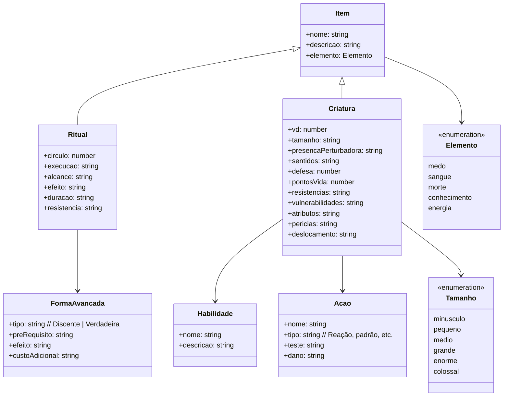

# Ordo Realitas

Sistema web inspirado no universo de RPG paranormal, com foco em rituais, criaturas e gerenciamento de agentes.

## 🌐 Estrutura de Rotas

```
Login (/)                                         # Login (tela inicial)
   ↓
Ordem (/ordem)                                    # Hub principal
   ├── Bestiário     (/ordem/bestiario)           # Criaturas
   │    └── Criatura (/ordem/grimorio/{criatura}) # Criatura {slug}
   ├── Grimório      (/ordem/grimorio)            # Rituais
   │    └── Ritual   (/ordem/grimorio/{ritual})   # Ritual {slug}
   └── Agentes       (/ordem/agentes)             # Fichas de Personagens
        └── Agente   (/ordem/agentes/{agente})    # Ficha de Personagem
```

- `/`: Autenticação.
- `/ordem/...`: Área protegida.
- `/ordem/agentes`: Lista/Fichas de Personagens.
- `(/ordem/agentes/{agente})`: Exemplo: `(/ordem/agentes/gustavo_freire)`

## 🔐 Login (`/`)

Tela inicial do sistema.

### Layout

- Logo central (Ordo Realitas)
- Texto: `Bem vindo, Agente.`
- Inputs:
  - `agent_id`
  - `password`

- Botão: `Acessar sistema`

### Feedback

- `Validando credenciais...`
- `Acesso autorizado`
- `Falha de autenticação`

### Fluxo

```
/ → /ordem
```

## 🧠 Ordem (`/ordem`)

Interface principal estilo sistema operacional com aplicativos.

### Layout

**Aplicativos em Grid**. Cada item abre um aplicativo do sistema operacional.

- :LiEye: Bestiário
- :LiFeather: Grimório
- :LiUsers: Agentes

### 👁️ Bestiário (`/ordem/bestiario`)

Catálogo de criaturas estilo dossiê.

#### Lista

- Grid de criaturas
- Filtros:
  - Elemento
  - VD (nível de perigo)

#### Detalhe

- Nome
- Elemento
- Presença Perturbadora
  - DT
  - Dano Mental
  - Imunidade >=NEX
- Vida
- Resistências
  - Tipo de Dano | Valor de Resistência
- Vulnerabilidade
- Defesa
- Atributos
  - Agilidade
  - Força
  - Intelecto
  - Presença
  - Vigor
- Perícias
  - Perícia | Quant. D20 | Adicional
- Deslocamento
- Habilidades
  - Habilidade | Descrição
- Ações
  - Agressões (Tipo da Ação)
    - Dano

---

### 📜 Grimório (`/ordem/grimorio`)

Catálogo de rituais.

#### Lista

- Grid de rituais
- Filtros:
  - Elemento
  - Círculo

#### Detalhes

```ts
export interface RitualCard {
  id: string;
  name: string;
  image: string;
  element: string;
  circle: number;
  execution: string;
  range: string;
  area: string;
  duration: string;
  resistance: string;
  target: string;
  description: string;
  fonte: string;

  forms: {
    type: "discente" | "verdadeira";
    description: string;
    custoPE: number;
    preReq: string;
  }[];
}
```

### 🧍 Agentes (`/ordem/agentes`)

Gerenciamento de agentes.

- Nome
- Patente

## 🎨 Sistema de Elementos

Cada item possui um elemento com efeito visual:

- **Morte** → espirais.
- **Energia** → glitch.
- **Conhecimento** → sigilos animados.
- **Sangue** → líquido.
- **Medo** → fumaça.

## 🧬 Modelagem de Dados


```mermaid
classDiagram

class Item {
  +nome: string
  +descricao: string
  +elemento: Elemento
}

class Ritual {
  +circulo: number
  +execucao: string
  +alcance: string
  +efeito: string
  +duracao: string
  +resistencia: string
}

class FormaAvancada {
  +tipo: string  // Discente | Verdadeira
  +preRequisito: string
  +efeito: string
  +custoAdicional: string
}

class Criatura {
  +vd: number
  +tamanho: string
  +presencaPerturbadora: string
  +sentidos: string
  +defesa: number
  +pontosVida: number
  +resistencias: string
  +vulnerabilidades: string
  +atributos: string
  +pericias: string
  +deslocamento: string
}

class Habilidade {
  +nome: string
  +descricao: string
}

class Acao {
  +nome: string
  +tipo: string  // Reação, padrão, etc.
  +teste: string
  +dano: string
}

class Elemento {
  <<enumeration>>
  medo
  sangue
  morte
  conhecimento
  energia
}

class Tamanho {
  <<enumeration>>
  minusculo
  pequeno
  medio
  grande
  enorme
  colossal
}

Item <|-- Ritual
Item <|-- Criatura

Ritual --> FormaAvancada

Criatura --> Habilidade
Criatura --> Acao
Criatura --> Tamanho
Item --> Elemento
```
